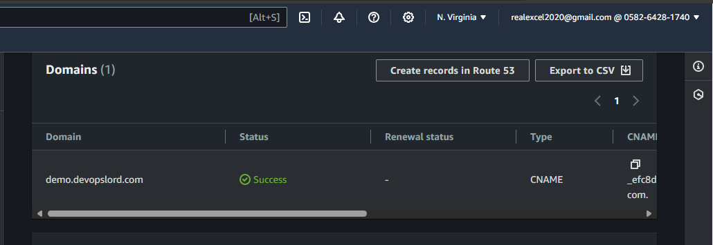
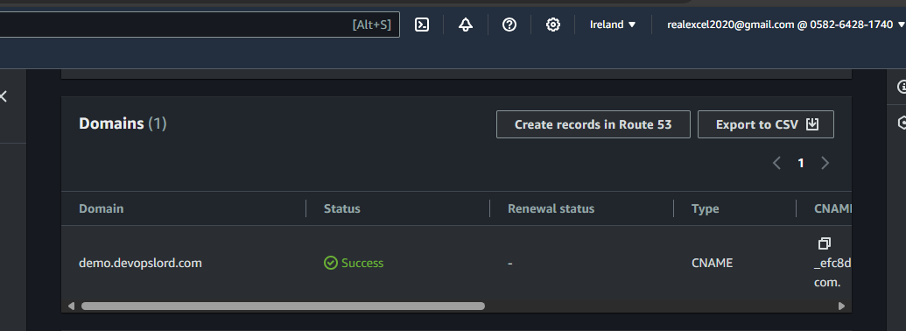

# Configuring the route 53 domain and ACM Certificates

This solution uses terraform variables (tfvars file) to assign domain name and TLS Certificate from ACM. To set up this TLS certificate manually, on the AWS console, head over to ACM in AWS console and request for a certificate using the domain name you own. Also ensure that you request for the certificate in both regions.

This example requests for ACM certificate in us-east-1 and eu-west-1 both regions are used to deploy the active active application set up.

1. Request for ACM certificate in us-east-1



Initially, when you request for a certificate using your prefared domain or sub domain (in our case demo.devopslord.com), it's state will be PENDING. To change it to Active state, copy the CNAME records and add them to your route 53 hosted zone in the other AWS account.

2. Request for ACM certificate in eu-west-1



Also request for a certificate in the seconda region and add the CNAME record to your route 53 hosted zone in the other AWS account.

Finally, edit the `terraform.tfvars` file and edit the domain name to match the domain ou verified using ACM. Also replace the ARNs for the cetifcates you created in both regions in the variable assignments.


## Using the API and Payload Format

The repo creates resoucres in three sections.
 - Multi-Region Active Active API that Allows you to send POST request to the api. The API recieves the requet and record data to an Aurora multi-region database configured with write forwarding. Requests coming from the secondary region using the database read endpoint will be forwarded to the globa db

 - Multi region API with event bridge and SQS. This implements a serverless pipeline where requests is forwarded from API gateway --> event bridge --> sqs --> lambda --> Aurora Database

 - API that recives a file as request and saves the file to an s3 bucket it has two use cases. 1. For public bukets 2. private buckets. it returns a download link with presigned URL for private bucket, and s3 bucket link for public bucket.


### Multi-Region Active Active App.

This section in api gateway contains the routes below:

```
/get-tickets --> GET request (List of all tickets created)
/create-ticket --> POST request (Create a ticket)
/create-tickets-table --> POST request (Creates ticket table and relations in database)

```

Ensure that you make a post request to `/create-tickets-table` route before making other requests on routes in this section. the payload can be empty

```
{}
```


To create a ticket, make a post request to `/create-ticket` route using the payload format as data below:

```
{
    "senderName": "John Doe",
    "senderBank": "Sample Bank",
    "senderAccount": "1101121",
    "receiverName": "Sample Nmae",
    "receiverBank": "TestBank2",
    "receiverAccount": "112110211",
    "amount": "40000"
}
```
make a GET request to `/get-tickets` to see all tickets you've created

### Multi-Region Active Active Event bridge pipe

This section in apiagetway contains the routes below

```
/create-revenue-table ---> POST request (creates table and relations in database)

/create-revenue-item ---> POST request (creates an item in the database)

/get-revenue-item ---> GET request (list all items created)

```

Ensure that you send a POST request to the route `/create-revenue-table` the payload can be empty. It creates the table in the database and relations.

To create a revenue item using the route `/create-revenue-item`, send a POST request using the payload format below: 

```
{
    "Action": "Add",
    "Attribute": "RevenueCode",
    "ExtSiteID": "CA",
    "Data": {
    "gc_revenue_code_id": 2,
    "source_id": 12,
    "RevenueCodeID":"13bc29b3-e2da-4007-95db-106423967dd0",
    "ExtRevenueCodeID":"MARQRT@",
    "RevenueCodeName": "David TEST 2",
    "Priority":1,
    "DrawDownAmount":0,
    "RCValue1":null,
    "RCValue2":null,
    "RCValue3":null,
    "RCValue4":null,
    "PropData": null,
    "IsCalcDrawDown":false
}
}

```

you can make a GET request to `/get-revenue-item` to see a display of all items.


### S3 bucket Upload with download link as response

This section deploys an API that recieves base64 encoded image as request and then uploads the image to s3. The API returns a download link as response.

This section contains two routes 

```
/upload-image-private ---> POST request (Image will be stored in a private bucket)
/upload-image-public ----> POST request (Image will be stored in a public bucket)

```

Make a POST request to any of the routes to demonstrate uploading files to s3 and getting either a public link or a presigned url. Use the payload format given below

The private bucket also has cross region repliction that automatically syncs bucket objects in the second region.


